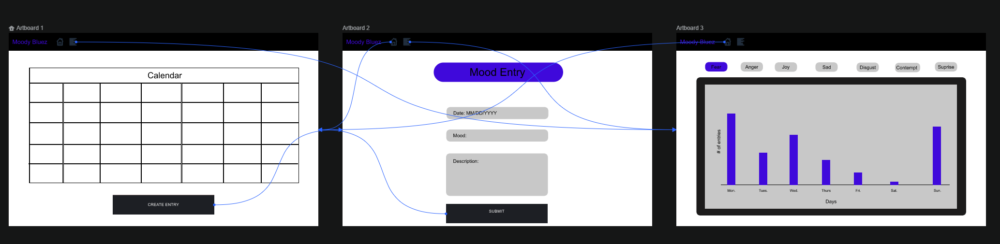
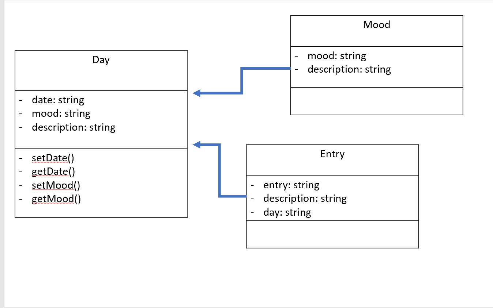

# Moody Bluez

## Introduction

Moody Bluez allows users to record their overall mood daily. At the end of the day the user can choose thier overall mood for the day and then write a description as to what they did during the day and what they feel may have caused their overall mood. The users dashboard will contain metrics such as what weekday they tend to be the most happy. Moody Bluez is for someone who is looking to monitor their habits and develop an understanding of what causes them to feel certain ways. Users can interact with Moody Bluez using a set of RESTful service endpoints.

## Storyboard

## Requirments

1. As a

### Example

**Given**:

**When**:

**When**:

**Then**:

2. As a

### Example

**Given**:

**When**:

**When**:

**Then**:

## Class Diagram

### Class Diagram Description

The day class will handle the date, string, and description. The day class will have methods to set and get the date and mood. 

The mood class will deal with the mood and description and will connect to the Day class. 

The entry class will deal with all the details of each entry such as the entry, description, and day. 

## JSON Schema

This is what we plan to export to another app.

> {
>  "type" : "object",
>  "properties" : {
>    "description" : {
>      "type" : "string"
>    },
>    "date" : {
>      "type" : "string"
>    },
>    "mood" : {
>      "type" : "string"
>    }
>  }
> }

## Team Members and Roles 

UI Specialist: Vismaya Manchaiah and Erich Wagner

Business Logic/Persistance: Puran Kansakar and Tianzuo Huang

DevOps/Product Owner/Scrum Master/Github Admin: Michael Williams

## Milestones

[Milestones](https://github.com/mikeal200/MoodyBluez/milestones)

## Projects

[Projects](https://github.com/mikeal200/MoodyBluez/projects)

## Standup

[We meet 8:00 PM Eastern on Discord](https://discord.gg/N6qNra5f36)
